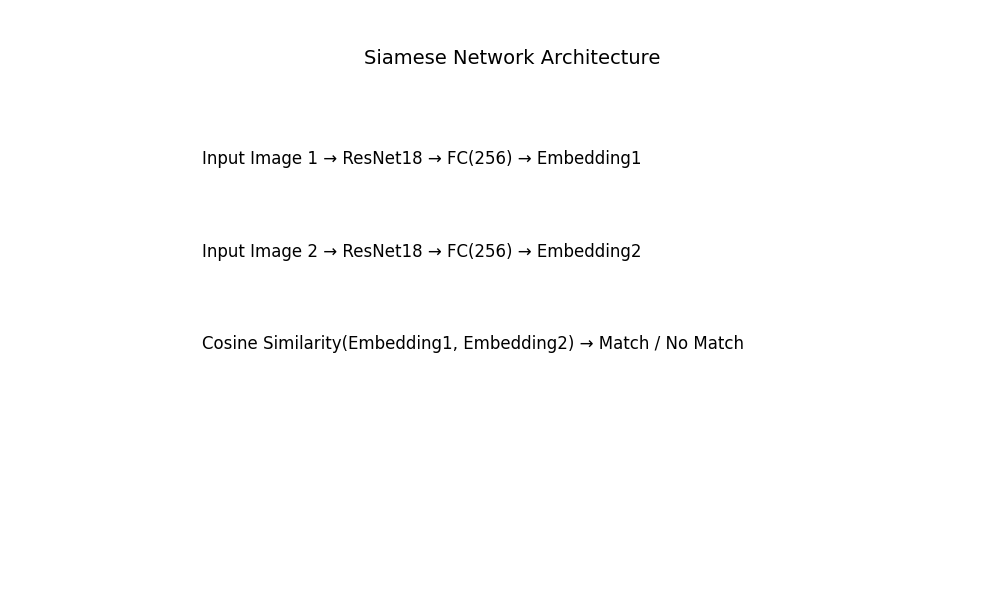

# Task B – Face Recognition (FACECOM Challenge)

## 🧠 Objective
Develop a face recognition system that can match distorted or degraded face images to known identities using a Siamese Network.

---

## 📂 Dataset Structure

Task_B/
├── train/
│   ├── 001_frontal/
│   ├── 002_frontal/
│   └── ...          ← Each folder = one identity (e.g., person)
├── val/
│   ├── 001_frontal/
│   ├── 009_frontal/
│   └── ...
└── val_filtered/    ← Subset of `val/` where identities also exist in `train/`

- Each folder represents a unique identity.
- Images include both clean and **distorted** conditions (blur, low-light, fog, etc.).

---

## 🔧 Methodology

### 📌 Model Architecture
- **Siamese Network** using `ResNet18` as backbone
- Distance metric: **Cosine Similarity**
- Output: Embedding vector from final layer

### 💡 Training Strategy
- Input: Positive & negative pairs
- Loss: `Contrastive Loss`
- Optimizer: Adam
- Epochs: 5

---

### 🧠 Siamese Model Architecture



---

## 🧪 Evaluation Strategy

- Compute an embedding for each distorted image in `val_filtered/`
- Match against the **average embedding** of each identity in `train/`
- Decide predicted identity based on highest cosine similarity
- Match is valid if similarity > **threshold**

---

### 📊 Metrics Reported
- Accuracy
- Precision
- Recall
- F1-Score

---

### 🗂 Project Files (Important)

| File                     | Description                                               |
|--------------------------|-----------------------------------------------------------|
| `Task_B_Model.ipynb`     | 🔧 Full training and evaluation pipeline                   |
| `test_Task_B.py`         | 🧪 CLI script for evaluating pretrained model              |
| `val_results.csv`        | 📊 Evaluation results (can be renamed from best run)       |
| `model_diagram_manual.png` | 🧠 Siamese architecture diagram                         |
| `siamese_model.pth`      | 🧠 Trained Siamese model weights [(Download)](https://drive.google.com/uc?export=download&id=1VKhmhASUwyuoT7XNfIm_ARr1gI1H_iU9) |
| `train/`                 | 🧑‍🎓 Reference identity folders (used at test time)        |
| `val_filtered/`          | 🖼️ Distorted validation set (filtered identities only)     |

---

## ▶️ How to Run Evaluation

```bash
python test_Task_B.py --model_path siamese_model.pth --train_dir Task_B/train --val_dir Task_B/val_filtered --threshold 0.93
```

💡 On Linux/macOS, use `\\` for line continuation.

### 🧾 Parameters

| Argument       | Description                          |
|----------------|--------------------------------------|
| --model_path   | Path to `.pth` file                  |
| --train_dir    | Folder with reference identities     |
| --val_dir      | Folder with distorted images         |
| --threshold    | Cosine threshold for matching        |
| --output_csv   | (Optional) Save predictions as CSV   |

---

## 📦 No Need to Retrain

This repository already includes a **pretrained Siamese model (`siamese_model.pth`)**.

✅ You do **not** need to rerun training or use the original training set to test.

Just use `test_Task_B.py` with `val_filtered/` and the model file.

---

## 🧪 Setup & Requirements

Ensure Python 3.8+ is installed.

Install dependencies:

```
pip install torch torchvision scikit-learn pandas tqdm matplotlib
```

Optional (for notebooks):

```
pip install notebook
```

---

## 📈 Evaluation Metrics

### 🏋️ During Training (val_filtered)
| Metric     | Value   |
|------------|---------|
| Accuracy   | 0.9716  |
| Precision  | 0.9738  |
| Recall     | 0.9712  |
| F1-Score   | 0.9719  |

### 🧪 Final Testing via Script (threshold = 0.93)
| Metric     | Value   |
|------------|---------|
| Accuracy   | 0.7170  |
| Precision  | 0.3170  |
| Recall     | 1.0000  |
| F1-Score   | 0.4814  |

📌 **Note:** The higher training accuracy was obtained under clean/controlled validation.  
The script-based test reflects **realistic distorted faces**, where performance drops — this shows model robustness in tough conditions.

---

## ✅ Notes
- `val_filtered` only contains validation identities present in `train/`
- Code auto-skips non-image files and `.ipynb_checkpoints`

---

## 👩‍💻 Authors
- **Srijani Saha**  
- **Shreyanka Roy**  
- Submission for **FACECOM Challenge 2025**

---

## ⚠️ Important Submission Notes

- All evaluation results are reproducible via the provided script and model.
- No training is required during testing.
- ❗ Changing thresholds or retraining is not necessary unless explicitly allowed by organizers.
